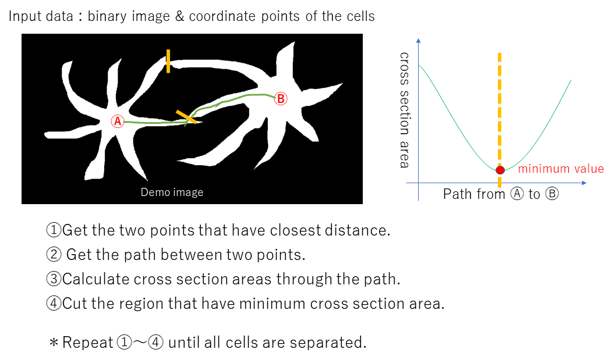

# Cell_Splitter
Extract regions of the cells from binary image(2D or 3D) and coordinates of the cells

## Dependencies
MATLAB R2019a  or later

## Preparation of input files
Two data files are needed, binary image (as tif file) and cordinate information of the cells (as csv file) for input data.

In csv file, only columns 6 to 8 (6 to 7 for 2D image) are used. Cordinate information must be there.

I recommend using the U-Net segmentation of ImageJ plugin (https://lmb.informatik.uni-freiburg.de/resources/opensource/unet/) to get the binary image. 

I recommend using ImageJ point tool ROI and Measure command (or U-Net detection of Fiji plugin) to get the cordinate information of the cells.

二値化されたtif画像ファイルと細胞の位置を示したcsvファイルの2つが必要。csvファイルのうち6から8列目のみを使用する。座標情報がそこ(6から8列目)に来るようにする。

二画像の取得にはImageJ pluginのU-Netの使用を勧める。また、細胞の座標情報の取得にはImageJのPoint ROI tool と Measureコマンドを勧める。

## Usage
Open "Cell_Splitter.m" and set the parameters ,run the code (F5 or RUN). Select the binary image (tif file).

Image must be the 8 or 16 bit grascale tif image. You can use binary stack tif image for 3D input.

"Cell_Splitter.m"を開いてパラメータを設定したら、F5または実行ボタンで実行する。画像選択画面が現れるので、入力の二値画像を選択する。

画像は8または16bitのグレースケールのtif画像である必要がある。3次元データを使用するときは、スタックのtif画像を入力にする。

## Demos
You can use the "demo_image_2D.tif" and "Results.csv" for demos.

"demo_image_2D.tif" と"Results.csv"をデモとして使用できる。

## Author
Takehiro Ajioka 

E-mail:1790651m@stu.kobe-u.ac.jp

## Affiliation

Division of System Neuroscience, Kobe University of Graduate School of Medicine

神戸大学医学研究科システム生理学分野
